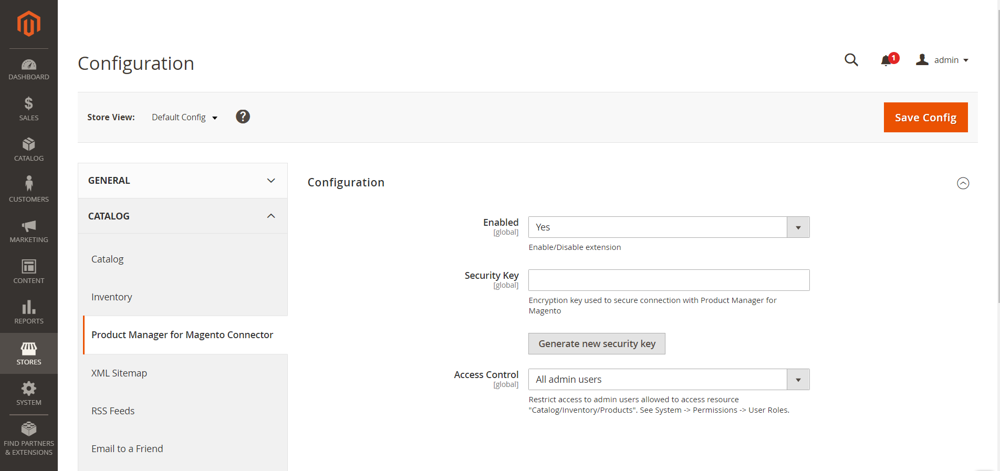
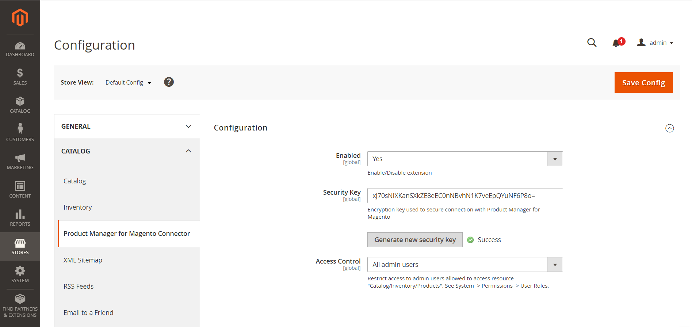
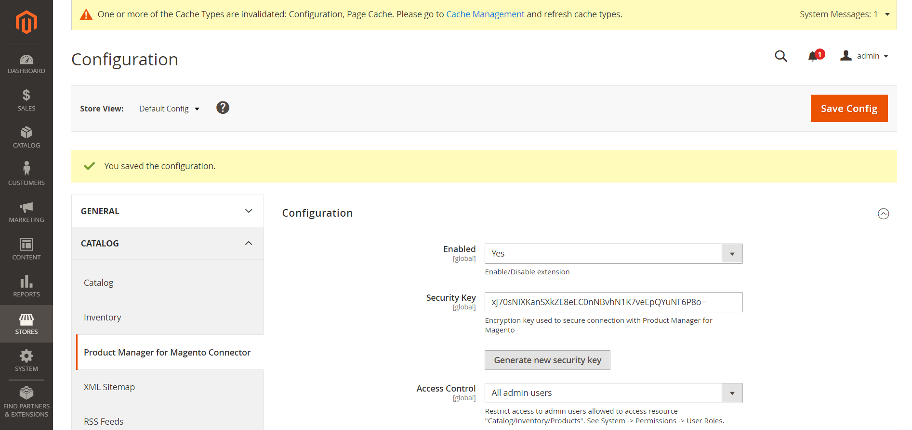

# Product Manager Manager for Magento Connector

This Magento 2 extension must be used with
[Product Manager for Magento](https://www.benabee.com/en/product-manager-for-magento).

It allows the software to connect to the Magento website and access the website data.


## Installation

The extension can be installed using Composer or an archive file.

### Installation using Composer
```
composer require benabee/product-manager-connector --no-update
php bin/magento module:enable Benabee_ProductManagerConnector
php bin/magento setup:upgrade
```

### Installation using archive file

Download the extension on this page:
https://github.com/Benabee/product-manager-for-magento-connector/releases/latest


Upload the archive to the Magento root folder and run these commands:
```
tar xvzf product-manager-connector-1.2.0.tar.gz app/code/Benabee/ProductManagerConnector/
php bin/magento module:enable Benabee_ProductManagerConnector
php bin/magento setup:upgrade
```


## Configuration

To configure the extension, open the admin panel and go to ```Stores``` > ```Configuration``` > ```Catalog``` > ```Product Manager for Magento Connector```.


Click Generate new security key.


Click Save Config.


Copy the security key.

Click File > Configuration Wizard in Product Manager.

Choose Connect with "Product Manager Connector extension (Magento 2 only)".

Paste the secret key.

Complete the Configuration Wizard.

## Update
### Update to latest version using Composer
```
composer update benabee/product-manager-connector
php bin/magento setup:upgrade
```

### Update to latest version using archive file
Upload the archive to the Magento root folder and run these commands:
```
rm -rf app/code/Benabee/ProductManagerConnector
tar xvzf product-manager-connector-1.2.0.tar.gz app/code/Benabee/ProductManagerConnector/
php bin/magento setup:upgrade
```

Version history
===============
- Version 0.2 based on bridge version 2.1.8
- Version 0.3 based on bridge version 2.4.0
- Version 1.0.0 based on bridge version 2.4.0
- Version 1.1.0 based on bridge version 2.4.1
- Version 1.2.0 based on bridge version 2.4.2


